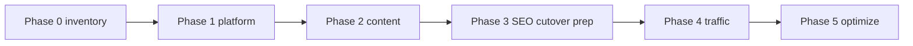

# Phase roadmap — chuyển đổi sang Next.js + Strapi (từ codebase hiện có)

**Nguyên tắc:** Giảm rủi ro SEO và vận hành; mỗi phase có **exit criteria** đo được.

---

## Phase 0 — Discovery & inventory (2–4 tuần)

**Objective:** Không còn “lỗ đen” URL và funnel.

| Work item | Output | Impact |
|-----------|--------|--------|
| Crawl + export URL live (Screaming Frog / server log) | Danh sách URL, status, template | Tránh 404 sau cutover |
| Map funnel: mở TK, trading, research, legal | Sơ đồ journey | Đảm bảo CTA không gãy |
| Content parity checklist (VI/EN) | Gap list | Giảm bounce sau launch |
| Baseline Lighthouse (mobile) trên 5 URL chính | Số liệu p75 | Chứng minh “before” |

**Exit:** Bảng redirect 301 đầy đủ + sign-off Product/Legal.

---

## Phase 1 — Platform hardening (song song, 3–6 tuần)

**Objective:** Production-ready theo `docs/technical-requirements.md` P0.

| Work item | Evidence trong repo / TR |
|-----------|-------------------------|
| Env production: `SITE_URL`, Strapi, CDN `remotePatterns` | TR §2.3, §2.4 |
| CORS Strapi production origins | `apps/cms/config/middlewares.ts` |
| Contact form → kênh thật (SMTP/ticket) | TR §5.2 |
| Security headers + review CSP với GTM | `next.config.ts`, TR §4.3 |

**Exit:** Staging end-to-end với dữ liệu giả; không lộ secret client.

---

## Phase 2 — Content migration & parity (4–8 tuần)

**Objective:** Strapi là nguồn đúng cho các hub chính.

| Work item | Impact |
|-----------|--------|
| Import news/research/events/careers vào Strapi | Sitemap động có ý nghĩa |
| Section blocks cho trang dài | Marketing tự phục vụ |
| Đồng bộ hình ảnh/uploads lên CDN | LCP |

**Exit:** So sánh content QA sign-off với owner từng line of business.

---

## Phase 3 — SEO/GEO cutover prep (2–4 tuần)

**Objective:** Không mất tín hiệu khi đổi stack.

| Work item | Impact |
|-----------|--------|
| Validate canonical/hreflang trên mọi template | Tránh duplicate |
| `seo:audit` trong CI | Regression sớm |
| GSC: property, sitemap mới, inspect URL | Giảm thời gian re-index |
| Publish `llms.txt` | GEO |

**Exit:** Rich Results test pass cho Organization + Article mẫu.

---

## Phase 4 — Traffic migration (1–2 ngày + hypercare)

**Objective:** Chuyển DNS hoặc reverse proxy sang Next.

| Bước | Ghi chú |
|------|---------|
| Freeze content nhỏ trên live cũ | Tránh drift |
| Bật 301 từ URL cũ (đã chuẩn bị Phase 0) | Giữ equity |
| Theo dõi 5xx, 404, GSC Coverage | MTTR |

**Exit:** 7 ngày không spike lỗi; top queries không sụt > ngưỡng đã thống nhất.

---

## Phase 5 — Optimize & scale (liên tục)

| Hạng mục | TR ref |
|----------|--------|
| On-demand revalidation | §2.5 |
| Rate limit GraphQL/public API | §3.3 |
| RUM + APM | §3.4, §7 |
| MFA admin Strapi | §4.1 |

---

## Dependency diagram (đơn giản)

---

## Gợi ý đội hình

- **Tech lead / FE:** Next, redirects, performance.
- **Backend/CMS:** Strapi model, webhook revalidate.
- **SEO:** GSC, hreflang, schema, log analysis.
- **Product:** funnel và messaging sign-off.
- **Legal/Compliance:** disclaimers, cookie/analytics.
